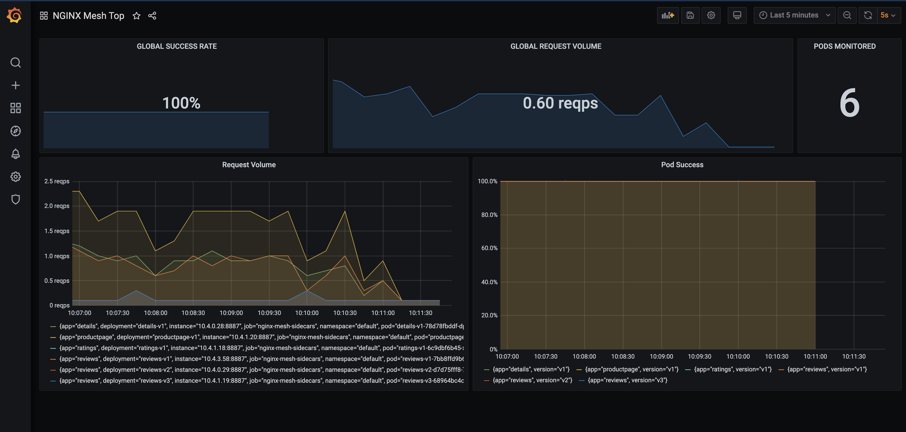

# Grafana Dashboard

Two Grafana dashboards have been included as examples for use in your environment: 
- NGINX Mesh Top
- NGINX Service Mesh Summary

Both Grafana dashboards provide a high-level picture of the request volume and success rate of all your applications in the mesh, and each have been included to provide two different references for consuming and rendering NGINX Service Mesh metrics data. 

You can import either or both example dashboards included in this directory into your Grafana deployment.

## Prerequisites
- Grafana version >= 6.6.0
- Prometheus datasource must be [configured](https://prometheus.io/docs/visualization/grafana/#creating-a-prometheus-data-source).
  
  **Note:** Make sure to add the NGINX Service Mesh [scrape config](../prometheus/README.md) to your Prometheus configuration.

## Installing Example Dashboards

To install an example dashboard using the Grafana UI follow these steps:
- Click on Import under the Dashboards icon in the side menu.
- Upload the dashboard JSON, ex: [nginx-mesh-top.json](nginx-mesh-top.json), file or copy and paste the contents of the file in the textbox and click Load.
- Select the Prometheus data source you configured previously from the dropdown menu and click Import.

### Features
The default NGINX Mesh Top dashboard includes the following stats and graphs:

- Stats:
  - Global Success Rate: the percentage of requests that are successful over the last 30 seconds (`nginxplus_upstream_server_responses` with response codes of `1xx` or `2xx`).
  - Global Request Volume: the volume of requests over the last 30 seconds, measured in requests per second (`nginxplus_http_total_requests`) . 
  - Pods Monitored: The number of pods being scraped by Prometheus.
- Graphs:
  - Request Volume: this graph shows the volume of requests per Pod, in requests per second (`nginxplus_http_total_requests`).
  - Pod Success:  this graph shows the percentage of requests that are successful per Pod (`nginxplus_upstream_server_responses` with response codes of `1xx` or `2xx`).
  - Sidecar Memory Usage (RSS): this graph shows the Resident Set Size (RSS) of the NSM sidecars.
  - Sidecar Memory Usage (Private): this graph shows the Private memory used by the NSM sidecars.

## Customizing your own Dashboard

NGINX Service Mesh exposes NGINX Plus metrics in Prometheus format that can be used to create your own panels and custom dashboards. For a list of available metrics, labels, and example Prometheus queries, see the [Traffic Metrics guide](https://docs.nginx.com/nginx-service-mesh/guides/prometheus-metrics/).
